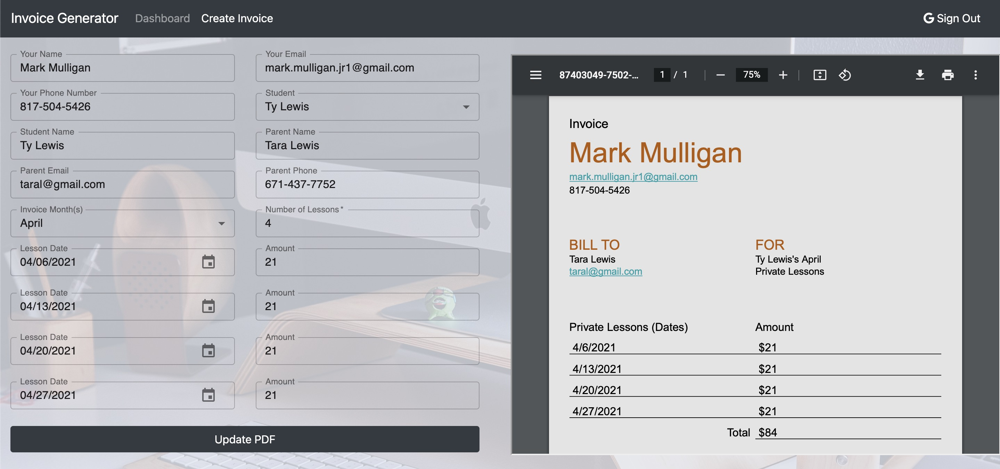
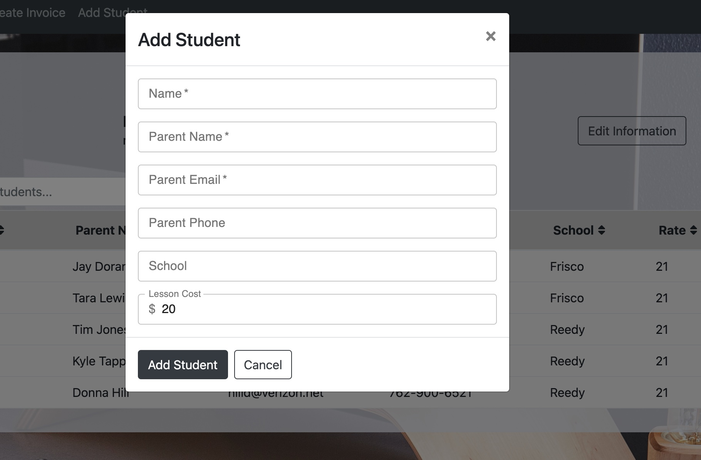

# Invoice Generator




## Description 
I built this application for one of my friends who is a private music teacher.  He spends a lot of time putting together invoices for the parents of the students he teachers each month.  This program is designed to streamline that process.  I also included a way to save and organize a roster of students.  This data is present to the user in the form of table to can be easily searched and sorted. 

I used google oauth to login in the users, mongoDB to store all the nessary data, and the react-pdf package to create and generate professional invoices that can be downloaded and used as needed.  

### View the Project Live <br>
https://react-google-books-app-1.herokuapp.com/

#### Built With
* React.js
* Node.js
* MongoDB
* Boostrap
* [react-pdf](https://github.com/diegomura/react-pdf)

## Usage 

#### Dashboard

* On this page, the users profile information is displayed.  It is automatically populated from their google account but can be changed and saved for later.  Here the user can also view a table of all their students.  They can add, edit, or delete students from this table.  The table is sortable by each column and there is a global search function as well.   


* To add a student, click the add student button at the top of the screen, then fill out all the information on the form to add a student.



* To edit a student, click on the row that contains the student you would like to edit in the table.  This will make a modal appear where you can update an information about the student you would like.  


* To delete a student, click on the row that conatins the student you would like to delete.  On the modal that opens up, select the delete student option.  

#### Invoice Page

* This page is used to generate invoices.  The form is automatically populated with your profile data.  Simply select the student would like to create the invoice for.  When this is done, the rest of the their data will be automatically populated in the form.  However, if you would like, you can change any information in the form you want.  When you are done filling out the form, click generate PDF.  This will show you a preview of your generated pdf.  Click download pdf on the top of the preview screen.  If you wish to make changes, simply change the information in the form and click update PDF.    


## Installation

### Run the Project Locally

* Step 1: Navigate to the directory you want to store the project. Clone this your repository to your local computer using the command below. 
```bash
git clone https://github.com/Mark-Mulligan/lesson-invoice-generator-v2.git
```

* Step 2: Use the command line to navigate to the directory that you cloned the project.
Example:
```bash
cd directory/projectdirectory
```

* Step 3: Install the npm package dependencies from the package.json file.
```bash
npm install
```

* Step 4: Set up google oauth2.  You will need to follow the instructions below and update the environment variables both in the client. <br> 
https://developers.google.com/identity/protocols/oauth2/web-server

* Step 5: Update the environment variables in the config folder in db.js to allow you to access your local instance of mongoDB. <br>
https://docs.mongodb.com/manual/administration/install-community/

* Step 6: While in the project directory, run the program using node using the command below. Open you browser and navigate to localhost:3000 to view the application (Make sure your mongoDB instance is running and you have set up google o auth).
```bash
npm start
```  

## Questions
[My Github](https://github.com/Mark-Mulligan) || mark.mulligan.jr1@gmail.com

#### How to Contact Me
Feel free to reach out to me if you have any questions about this project.  You can email me using the email listed above or can go to my github page to view my other projects and portfolio.

© Mark Mulligan 2021 All Rights Reserved.